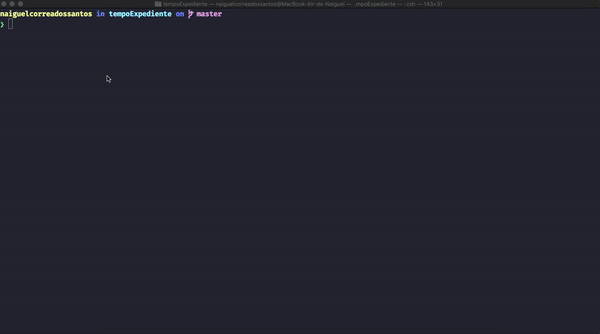

## SCRIPT TOSCO PARA CALCULAR HORAS DE TRABALHO



## Dependências

[NodeJS](https://nodejs.org/en/download/)

## Rodando o script

Rode no console o seguinte comando e vá respondendo as perguntas.

```
node inputs.js
```

Perguntas e exemplo de respostas:

```
Que horas você começou a trabalhar no primeiro turno (formato HH:mm) ? 09:11

Que horas você finalizou o expediente do primeiro turno (formato HH:mm) ? 12:15

Que horas você começou o expediente do segundo turno (formato HH:mm) ? 13:15

Seu banco de horas está positivo (tecle = P) ou negativo (tecle = N) ? P

Qual o tempo do seu banco de horas (formato HH:mm) ? 00:15
```

Resultado no console:

```
----------------------------------------------------
Iniciou a trabalhar às: 09:11
----------------------------------------------------
Saiu para o intervalo às: 12:15
----------------------------------------------------
DE MANHÃ TRABALHOU O TOTAL DE: 03:04
----------------------------------------------------
Banco de horas é: 00:15 P
----------------------------------------------------
Hora total para hoje, com banco de horas: 07:45
----------------------------------------------------
De tarde tem que trabalhar: 04:56
----------------------------------------------------
Iniciou de tarde às: 13:15
----------------------------------------------------
Tem que trabalhar até as 18:11 para fechar 8 horas
----------------------------------------------------
Bateu ponto às 18:53
----------------------------------------------------
Banco de horas do dia: 00:42
----------------------------------------------------

OBRIGADO !!!
```
